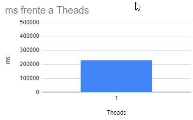
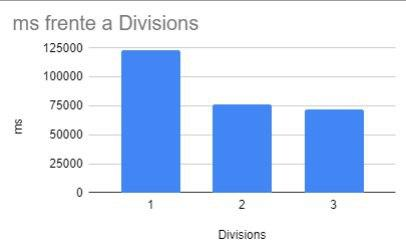
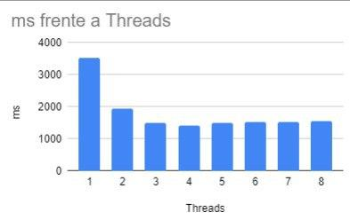

# Image processing pipeline

## Statement

Write a program to run from the console that does the processing of a series of images (use attached file) applying 
a grayscale conversion and a Gaussian blur (blur).

With the option "-d VALUE" the strategy of "divide and conquer" will be used. If "VALUE" is 0, a single thread is 
used (equivalent to the sequential approximation). If it is 1, the list is divided once. For 2, twice. And successively.

With the option "-p VALUE" the "threadpool" strategy will be used. With two Runnables, one for each task (grayscale and 
blur). The first injects the second. VALUE will be the number of threads in the Qt threadpool.

Analyze the performance from the execution times for the two strategies and the number of threads. For this, a graph (or
 table) will be made. Remember that the execution time is taken as the minimum of a series of executions. Include the 
 analysis along with a brief explanation of the process and the results in the README.md in English.

Frequent and consistent commits are recommended. With messages in English.

Optional: To upload a note. If the program is launched with the root user, it will use real time planning and 
priorities. And the performance data is added to the analysis. (It can be done for the divide and you will win or for 
the "threadpool").

## Analysis

The analysis has been carried out on a laptop with an i5-8250U @ 1.60GHz processor.
Sets of 10 samples taking the lowest value

#### Secuential

#### Divide and Conquer

#### ThreadPoll

